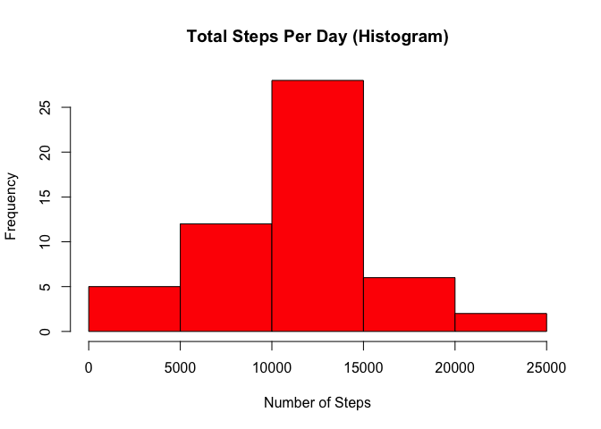
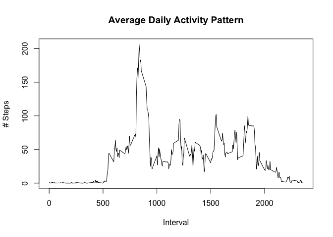

## Loading and preprocessing the data (also unzip raw data)

```r
# set working directory to "/Users/brad/Documents/development/repos/coursera/reproducible research/project 1"
setwd("/Users/brad/Documents/development/repos/coursera/reproducible research/project 1/RepData_PeerAssessment1")

# Download the raw data file (zipped)
# Raw File location: https://d396qusza40orc.cloudfront.net/repdata%2Fdata%2Factivity.zip

raw_file <- "https://d396qusza40orc.cloudfront.net/repdata%2Fdata%2Factivity.zip"
curr_dir <- getwd() 
raw_file_full_path <- paste(getwd(),"//raw data//repdata_data_activity.zip",sep="")

download.file(url = raw_file,
              destfile= raw_file_full_path, 
              method="curl")


# Extract the zip file
# unzip the data file and rename it locally
unzip(zipfile = raw_file_full_path, exdir=".//raw data")

# read in the data
activity <- read.csv("./raw data/activity.csv",header = TRUE)
summary(activity)
```

```
##      steps            date              interval     
##  Min.   :  0.00   Length:17568       Min.   :   0.0  
##  1st Qu.:  0.00   Class :character   1st Qu.: 588.8  
##  Median :  0.00   Mode  :character   Median :1177.5  
##  Mean   : 37.38                      Mean   :1177.5  
##  3rd Qu.: 12.00                      3rd Qu.:1766.2  
##  Max.   :806.00                      Max.   :2355.0  
##  NA's   :2304
```


## Question 1: What is mean total number of steps taken per day?
### Calculate total number of steps per day

```r
steps_per_day <- tapply(activity$steps, activity$date, sum)
```
### Make a histogram of the total number of steps taken each day

```r
hist(steps_per_day,
     col = "red",
     main ="Total Steps Per Day (Histogram)",
     xlab = "Number of Steps", 
     ylab = "Frequency")
```

<!-- -->

### Calculate and report the mean and median of the total number of steps taken per day

```r
mean_steps_per_day <- mean(steps_per_day, na.rm = TRUE)
median_steps_per_day <- median(steps_per_day, na.rm = TRUE)
paste("Mean number of steps per day: ",mean_steps_per_day)
```

```
## [1] "Mean number of steps per day:  10766.1886792453"
```

```r
paste("Median number of steps per day: ",median_steps_per_day)
```

```
## [1] "Median number of steps per day:  10765"
```
## Question 2: What is the average daily activity pattern?

### Make a time series plot (i.e. \color{red}{\verb|type = "l"|}type = "l") of the 5-minute interval (x-axis) and the average number of steps taken, averaged across all days (y-axis)

```r
total_steps_per_interval <- tapply(activity$steps, activity$interval, mean, na.rm = TRUE)
plot(as.numeric(names(total_steps_per_interval)), 
     total_steps_per_interval, 
     main = "Average Daily Activity Pattern",
     xlab = "Interval",
     ylab = "# Steps", 
     type = "l")
```

<!-- -->

### Which 5-minute interval, on average across all the days in the dataset, contains the maximum number of steps?

```r
# Sort the total steps per interval in decreasing order and grab the top result.
max_interval <- names(sort(total_steps_per_interval, decreasing = TRUE)[1])
max_steps <- sort(total_steps_per_interval, decreasing = TRUE)[1]
paste("The interval with the maximum number of steps is",max_interval)
```

```
## [1] "The interval with the maximum number of steps is 835"
```

```r
paste("The maximum number of steps in that interval is",max_steps)
```

```
## [1] "The maximum number of steps in that interval is 206.169811320755"
```

## Question 3: Imputing missing values

### Calculate and report the total number of missing values in the dataset.

### Devise a strategy for filling in all of the missing values in the dataset. 

### Create a new dataset that is equal to the original dataset but with the missing data filled in.

### Make a histogram of the total number of steps taken each day and calculate and report the mean and median total number of steps taken per day. 

## Question 4: Are there differences in activity patterns between weekdays and weekends?

### Create a new factor variable in the dataset with two levels – “weekday” and “weekend” indicating whether a given date is a weekday or weekend day.

### Make a panel plot containing a time series plot of the 5-minute interval (x-axis) and the average number of steps taken, averaged across all weekday days or weekend days (y-axis).
